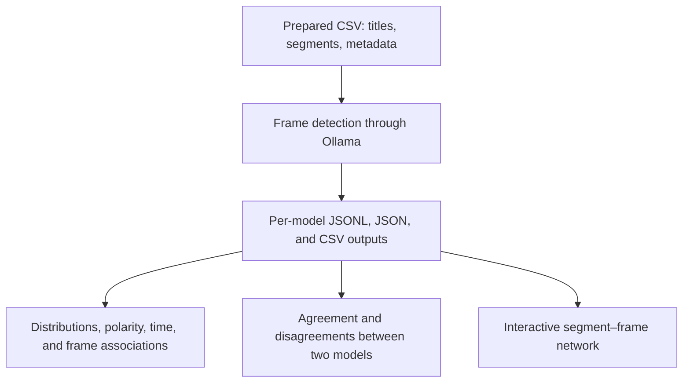

# Detecting media frames in *Shenbao* articles on returned students, 1872–1949

This repository documents a notebook-based workflow for studying how returned students are represented in *Shenbao* (申報) within the newspaper's 1872–1949 historical scope. It combines large language model (LLM) frame detection, descriptive and comparative analysis, and an interactive network linking article segments to detected frames.

The workflow applies a predefined codebook to **article titles and individual text segments**. It identifies six frame families and their positive or negative polarity, records supporting evidence, and extracts actors and events associated with the framing. Although the research focus is U.S.-returned students, the codebook also covers representations of overseas students and study abroad where relevant to the supplied text.

The dates in the title describe the research scope; the actual coverage of any analysis depends on the input dataset. These notebooks begin with an already prepared, segmented CSV. They do not perform newspaper digitization, OCR, corpus retrieval, or initial segmentation.

## Repository contents

The four notebooks serve three stages: detection, analysis through two complementary notebooks, and network visualization.

| Notebook | Role | Main outputs |
| --- | --- | --- |
| [framing_optimized_prompt.ipynb](scripts/framing_optimized_prompt.ipynb) | Applies the frame codebook through Ollama; validates model responses, grounds evidence, and supports resumable processing. | JSONL records, consolidated JSON, flattened CSV, and a background-run log when enabled. |
| [framing_results_analysis.ipynb](scripts/framing_results_analysis.ipynb) | Analyzes frame distributions, polarity, change over time, and relationships between frames across one or more models. | Notebook tables and charts, summary CSVs, and selected PNG/interactive HTML exports. |
| [compare_frames.ipynb](scripts/compare_frames.ipynb) | Aligns two models' predictions and examines agreement, partial overlap, quality issues, and segment-level disagreements. | Agreement tables, diagnostic and disagreement CSVs, PNG charts, and a text report with provenance. |
| [interactive_frame_network.ipynb](scripts/interactive_frame_network.ipynb) | Builds an interactive segment ↔ frame-type bipartite network from existing detection CSVs. | `frame_segment_network.html`. |

The links above follow the supplied notebook layout:

```text
.
├── README.md
├── data
    ├── frames_debate_complete_gemma3_27b.csv
    └── frames_debate_complete_qwen3.5_35b.csv
├── scripts
    ├── framing_optimized_prompt.ipynb
    ├── framing_results_analysis.ipynb
    ├── interactive_frame_network.ipynb
    └── compare_frames.ipynb
└── output/
    ├── frame_segment_network.html
    └── tables/
```

Data files and generated outputs must be supplied or produced separately. Their locations are configurable in the notebooks.

## Workflow



Detection is the only stage that requires LLM inference. The two analysis notebooks and the network notebook read previously generated CSVs.

## Frame codebook

The detection prompt draws on the framing concepts of Goffman (1974) and Entman (1993). A frame requires textual emphasis that directs interpretation, evaluation, causal understanding, or normative judgment. A keyword, factual reference, or neutral administrative statement is insufficient on its own.

Each frame family is evaluated independently. Multiple frames may be included when each meets the threshold; frames are not ranked as dominant or secondary.

| Frame family | Positive polarity | Negative polarity |
| --- | --- | --- |
| `modernization` | Contribution to reform, progress, reconstruction, useful expertise, or institutional capacity. | Failed expectations, ineffective reform, or a mismatch between foreign training and national or social needs. |
| `patriotism` | Loyalty, national service, sacrifice, or defense of national interests. | Disloyalty, betrayal, or abandonment of national duty. |
| `victimhood` | Sympathetic representation of students as victims of hardship, discrimination, repression, or other external conditions. | Representation of students as exploiters, predators, threats, or harmful competitors. |
| `moral` | Integrity, discipline, public spirit, selflessness, or upright conduct. | Corruption, dishonesty, selfishness, careerism, or moral decline. |
| `economic` | Valuable investment, productive human capital, efficient expenditure, or material benefit. | Financial burden, scarcity, waste, unequal access, or poor resource allocation. |
| `diplomacy` | International representation, mediation, cultural exchange, or advocacy across national audiences and institutions. | Foreign manipulation, imperial influence, domination, or cultural penetration. |

These six families yield **12 frame × polarity categories**, such as `modernization (positive)` and `economic (negative)`. The complete operational definitions and boundary rules are embedded in the detection notebook's `SYSTEM_PROMPT`.

Polarity describes the direction of the representation. In particular, **positive victimhood means sympathetic representation of students as victims**, even when the event itself is harmful. Financial hardship can independently support both `economic (negative)` and `victimhood (positive)`.

### Classification labels

The pipeline derives `frame_label` from the number of distinct, validated **frame-type values**, including polarity:

| Label | Meaning |
| --- | --- |
| `NOT_FRAMED` | No frame-type value satisfies the coding threshold. |
| `SINGLE_FRAME` | Exactly one frame-type value is retained. |
| `MULTIPLE_FRAMES` | Two or more frame-type values are retained. |

Consequently, both polarities of one family count as two frame-type values. A processing failure has a blank label and an error flag; it is not classified as `NOT_FRAMED`.

## Environment and input data

Use Python **3.10 or later** with Jupyter and the packages imported by the notebooks:

```bash
python3 -m venv .venv
source .venv/bin/activate
python -m pip install jupyterlab pandas numpy requests matplotlib seaborn scipy plotly pillow
jupyter lab
```

This is a starter environment based on the imports, rather than a version-pinned reproduction environment. Record package versions for a reproducible research release.

Detection requires a reachable **Ollama** server with the chosen model available. The notebook checks `OLLAMA_HOST` in the kernel environment, then attempts the institutional `module load ollama` setup, and finally falls back to `http://127.0.0.1:11434`. Set `OLLAMA_HOST` explicitly when using another server.

The supplied detection configuration selects `qwen3.5:35b`; commented alternatives include `gemma3:27b` and `llama3.3:70b`. The comparison notebook defaults to Gemma 3 27B versus Qwen 3.5 35B. Each run requires the corresponding model and adequate inference resources.

### Input CSV

Each row should represent one article segment.

| Column | Use |
| --- | --- |
| `title` | Required by detection; article title supplied to the model. |
| `segment_text` | Required by detection; segment supplied to the model. Blank segments are skipped. |
| `doc_id` | Stable article identifier; needed with `segment_index` for the network and frame-association analysis. Detection also accepts `DocId` when constructing identifiers. |
| `segment_index` | Segment identifier within an article. Use a stable, unique document–segment combination. |
| `date` or `year` | Recommended for temporal analysis and network year filters. Other supported date-column names are listed in the notebooks. |
| `source` | Optional metadata used by the comparison notebook's default grouped summaries. |
| `relevance_to_original_topic`, `topic_type`, `gender_mentioned` | Optional existing metadata exposed by network filters. Multiple `topic_type` values use semicolons. |
| `segmentation_label` | Optional; rows with `NO_RELEVANT_SEGMENT` are excluded by detection. |

Detection retains original row metadata. For records with document and segment identifiers, `_row_id` is constructed as `<doc_id>::seg<segment_index>`; otherwise it uses a hash of the identifying text fields. Keep identifiers and source text consistent across model runs.

## Running the notebooks

### 1. Detect frames

Open `framing_optimized_prompt.ipynb` and review its configuration before running the detection cells:

- Set `INPUT_DATASET`, `LOCAL_DATA_DIR`, and `LOCAL_OUTPUT_DIR`. The supplied default is `sample_debate`, resolved preferentially to `./data/sample_debate.csv`.
- Select `OLLAMA_MODEL` and confirm the server endpoint.
- Choose `BATCH_SIZE`: the default processes up to **100 pending rows per invocation**; `None` processes all remaining eligible rows.
- Choose foreground or background execution with `RUN_IN_BACKGROUND`; the supplied default is `True`.

The notebook writes its embedded worker to `frame_detection_articles.py` and launches it. Defaults include temperature `0.0`, a 32,768-token context setting, up to 3,200 generated tokens, checkpoints every 10 rows, and two retries after an initial failed attempt. Segment text exceeding `MAX_CHARS = 20000` is truncated before inference.

Successful `_row_id` values in the cumulative JSONL are skipped on subsequent invocations, while processing-error rows remain retryable. Consolidated JSON and CSV outputs retain the latest successful record for each identifier, or the latest failure if no successful record exists.

For the default dataset and model, outputs are:

```text
data/frames_sample_debate_qwen3.5_35b.jsonl
data/frames_sample_debate_qwen3.5_35b.json
data/frames_sample_debate_qwen3.5_35b.csv
data/frames_sample_debate_qwen3.5_35b.log  # background execution
```

Treat the log watcher and model-comparison cell as optional. **Do not use Run All indiscriminately for this notebook:** the watcher runs until interrupted, and interrupting it does not stop the detached worker. Wait for a background worker to finish before launching another run against the same output files.

The optional model-comparison cell defaults to Qwen and Llama on up to 50 pending rows per model. Its `CLEAN_COMPARISON_DIR = True` setting deletes the existing comparison directory before starting; change this setting if previous results must be retained. To compare models on the same sample, verify their matched identifiers afterward.

### 2. Analyze distributions and associations

Open `output/framing_results_analysis.ipynb`. Set `DATA_DIR`, or use `MANUAL_FILES` to select the intended model outputs explicitly. Auto-discovery searches `frames_*.csv` in the data directory and CSVs under its `frame_model_comparison/*/` subdirectories.

The notebook provides:

- Label counts and shares, plus a shared-row label agreement check across models.
- Counts and shares for the 12 signed frame types and six frame families.
- Polarity distributions, chi-square association tests, bias-corrected Cramér's V, and standardized residuals.
- Temporal counts and composition plots, including interactive Plotly exports; the default time-bin width is five years.
- Frame co-occurrence counts, Jaccard similarity, and lift, overall and by model.

Rows marked `frame_processing_error = TRUE` are excluded. Frame-type tables use an exploded representation with one row per segment–frame-type incidence. Summary tables are saved to `./analysis_outputs/`; selected visualizations are saved in the notebook's working directory as `frame_composition_over_time.png`, `frame_incidence_over_time.html`, `frame_composition_over_time.html`, and `frame_polarity_over_time_interactive.html` when the relevant cells run.

Use a valid date column for temporal cells and inspect the reported parsing coverage. Some later cells depend on objects produced earlier, including an unguarded Plotly export, so skip dependent cells when no usable temporal data exist. The final network section is an earlier embedded implementation; use the dedicated network notebook for the richer interface described below.

### 3. Compare two models

Open `framing_comparison/compare_frames.ipynb` and replace the supplied absolute Desktop paths in `CSV_A` and `CSV_B`. Set `OUTPUT_DIR` and model names, then run the notebook.

With `JOIN_KEYS = None`, matching uses `_row_id` if available in both files, otherwise `doc_id` and `segment_index`. Blank or duplicate join identifiers stop execution. Unmatched rows are exported separately.

The notebook reports exact agreement and Cohen's kappa for labels, unordered frame-family sets, signed frame-type sets, and joint label/type predictions. It also reports Jaccard overlap, conditional polarity agreement, per-frame prevalence and positive agreement, and grouped summaries by year and source where available.

Processing failures and source-text mismatches are excluded. Type metrics additionally exclude missing, malformed, or inconsistent predictions. Each metric has its own eligible denominator; two valid empty `NOT_FRAMED` sets count as agreement. Label/type count warnings are reported without automatically excluding a pair.

Key exports include `agreement_summary.csv`, `per_frame_statistics.csv`, `overlap_summary.csv`, `agreement_by_group.csv`, `segment_comparisons.csv`, `quality_issues.csv`, `unmatched_segments.csv`, `disagreements_*.csv`, `coverage.json`, and `report.txt`, alongside PNG charts. Disagreement exports preserve both models' predictions, evidence, explanations, and available source metadata. Use a fresh output directory when changing export options.

### 4. Build the interactive network

Open `output/interactive_frame_network.ipynb`, configure `DATA_DIR` or `MANUAL_FILES`, set `OUTPUT_FILE`, and run the notebook. It exports a bipartite graph with:

- **Segment nodes**, identified separately for each model.
- **Frame-type nodes**, representing frame families with polarity.
- **Edges**, indicating that a model assigned a frame type to a segment.

Unframed segments remain visible as isolated diamonds. Node size reflects degree in the currently filtered graph, and selecting a node reveals its metadata, evidence, and explanation where available.

Filters cover model, document, year range, frame label, frame family, polarity, relevance, topic type, gender mentioned, and minimum frame degree. Multiple selections within a filter use OR logic; different filter families combine with AND logic. Physics controls adjust or stop the layout. Rendering stops above the default limits of 10,000 edges or 15,000 visible segments until the filters are narrowed.

To preview the generated file, serve the directory containing it:

```bash
python3 -m http.server 8000
```

Open `http://localhost:8000/frame_segment_network.html` in a browser. The HTML embeds its data and loads the pinned `vis-network@9.1.9` library from `unpkg.com`, so that library requires network access. The exported HTML can also be placed in a GitHub Pages publishing folder. Its embedded metadata and evidence become accessible to anyone who can access the page.

## Output fields and evidence checks

| Field | Meaning |
| --- | --- |
| `frame_label`, `frame_type` | Count category and retained signed frame types. In CSV, multiple types are separated by `|`. |
| `frame_explanation` | English analytical justification for the classification. |
| `frame_evidence` | Evidence objects associating frame types with source quotations; stored as a JSON string in CSV. |
| `frame_evidence_grounded`, `frame_evidence_error` | Whether every detected type has a grounded quotation, and any evidence diagnostics. |
| `framing_actors` | Actors explicitly responsible for voicing, advancing, or reporting the framing. |
| `framed_actors` | Actors or groups represented through the frame. |
| `framed_events` | Events, processes, policies, or situations interpreted through the frame. |
| `framing_confidence` | Model-reported confidence between 0 and 1. |
| `frame_processing_error`, `frame_processing_error_type`, `processing_error` | Pipeline failure status and diagnostics. |
| `_row_id`, `_input_row_number`, `framing_model` | Alignment, input-order, and model provenance fields. |

Evidence and actor/event extractions are checked against the supplied source. Matching can tolerate punctuation, whitespace, and selected historical character variants, but retained spans are recovered from the original text. The pipeline attempts separate evidence and actor/event repair calls when needed. Unsupported actor/event values become `unspecified`.

**Missing grounded evidence does not invalidate an otherwise completed frame classification.** Inspect `frame_evidence_grounded` and `frame_evidence_error` separately: the analysis and network notebooks do not automatically restrict results to fully grounded classifications.

## Interpreting and reproducing results

- **Segment counts and frame incidences have different denominators.** One segment can contribute several incidences. Frame composition shares describe the distribution of incidences, while segment-level prevalence can sum above 100% across frames.
- **Model agreement measures consistency, not accuracy.** Human-coded validation is needed to assess whether predictions meet the research codebook. Model-reported confidence is not a calibrated probability of correctness.
- **Choose input files deliberately.** Auto-discovery can combine sample runs and full runs containing the same segments. The descriptive analysis does not generally deduplicate overlapping files; `MANUAL_FILES` helps control the analytical population.
- **Separate pooled and per-model associations.** Overall frame-association calculations group by document–segment identifier and can combine different models' frame assignments into one set. Per-model results are preferable when asking which frames a particular model detected together. Lift in this implementation uses segments present in the exploded, framed table as its population.
- **Treat association tests as exploratory.** Multiple incidences within a segment and repeated predictions across models are dependent observations. OCR quality, segmentation, sampling, temporal coverage, and model behavior also affect the findings.
- **Record run provenance.** Preserve the dataset version, prompt/codebook version, model tag, server/runtime and package versions, inference settings, date parsing, file selection, and exclusion counts. Use new output locations when changing the prompt or settings: resuming an existing JSONL skips previously successful rows.

Notebook paths are resolved relative to the kernel's working directory, which may differ from the repository root. Check the resolved paths printed by each notebook. The analysis notebook also contains an older detection-notebook filename and dataset-specific interpretation paragraphs; these should be checked against the actual inputs before reuse. No fixed numerical findings are asserted by this README.

## Data availability, citation, and licensing

The notebooks document processing and analysis; corpus access, OCR provenance, sampling criteria, and redistribution conditions should be documented for the dataset used in a release. Access to the full newspaper corpus should not be inferred from the research dates or notebook availability.

When citing this workflow, identify the repository version or commit, the notebook and codebook version, and the models used. Add project authorship, a preferred citation, and explicit code/data licenses before publication; those details are not established by the supplied notebooks.
